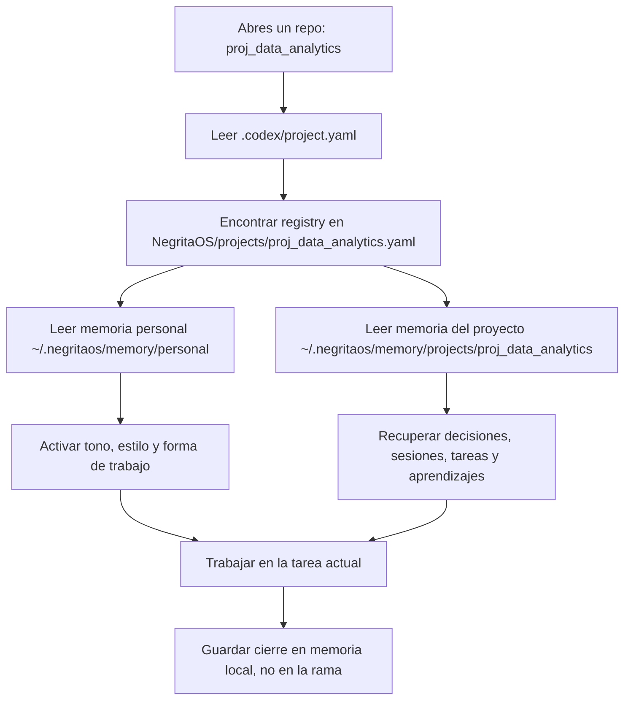
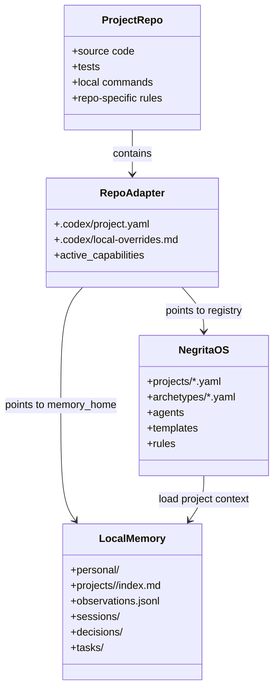

# NegritaOS Daily Usage Manual

## La Idea Simple

Piensa en el sistema como una escuela:

- **NegritaOS** es la directora. Sabe que agentes existen, como se trabaja, que tono usar y que calidad pedir.
- **Cada proyecto** es una clase distinta: `proj_data_analytics`, `moneyflowlist`, `ml_automl_autogluon`.
- **`.codex/project.yaml`** es la tarjeta en la puerta de la clase. Dice: "esta clase se conecta con esta parte de NegritaOS".
- **`~/.negritaos/memory`** es el cuaderno personal que no se pierde aunque cambies de aula, rama o worktree.

Los proyectos siguen donde estaban. No los movimos.

## Donde Vive Cada Cosa

```text
/Users/jackyb-cqi/repos/NegritaOS/
  projects/
    proj_data_analytics.yaml
    moneyflowlist.yaml
    ml_automl_autogluon.yaml
  archetypes/
  agents/
  skills/
  rules/
```

NegritaOS define el sistema.

```text
/Users/jackyb-cqi/repos/proj_data_analytics/.codex/project.yaml
```

El repo tiene un adapter que apunta a NegritaOS.

```text
~/.negritaos/memory/projects/proj_data_analytics/
```

La memoria real vive fuera del repo.

## Que Debes Decir Al Abrir Un Proyecto

Cuando abras `proj_data_analytics`, di algo como:

```text
Estoy en proj_data_analytics. Carga el adapter .codex/project.yaml,
lee el registry de NegritaOS que apunta ahí, y usa la memoria canónica del proyecto.
Quiero continuar con [tu tarea].
```

Ejemplo real:

```text
Estoy en proj_data_analytics. Carga .codex/project.yaml,
lee /Users/jackyb-cqi/repos/NegritaOS/projects/proj_data_analytics.yaml
y usa ~/.negritaos/memory/projects/proj_data_analytics.
Quiero continuar el análisis EDA de Hot/Orange TSR/CSR.
```

Para MoneyFlow:

```text
Estoy en moneyflowlist. Carga .codex/project.yaml,
lee el registry de NegritaOS para moneyflowlist y usa su memoria canónica.
Quiero continuar el trabajo de frontend/backend/product app.
```

Para AutoML:

```text
Estoy en ml_automl_autogluon. Carga el registry de NegritaOS
en projects/ml_automl_autogluon.yaml y usa la memoria canónica.
No modifiques .codex todavía porque está trackeado y dirty.
```

## Que Lee El Agente

El agente debe leer en este orden:

1. `.codex/project.yaml` dentro del repo actual.
2. `NegritaOS/projects/<project_id>.yaml`.
3. `~/.negritaos/memory/personal/`.
4. `~/.negritaos/memory/projects/<project_id>/index.md`.
5. Archivos relevantes en `sessions/`, `decisions/`, `tasks/` y `legacy_import/`.

## Diagrama De Flujo



## Diagrama UML De Componentes



## Regla De Oro

No le digas al agente solo:

```text
Sigue con el proyecto.
```

Dile:

```text
Carga el adapter .codex/project.yaml, luego el registry de NegritaOS,
y usa la memoria canónica del proyecto en ~/.negritaos/memory/projects/<project_id>.
```

Eso evita que trabaje con memoria equivocada o con una copia vieja.

## Como Crear Un Proyecto Nuevo

Usa el script:

```bash
/Users/jackyb-cqi/repos/NegritaOS/scripts/bootstrap_project_adapter.sh \
  --project-id nuevo_proyecto \
  --repo /ruta/al/repo \
  --archetypes eda_analytics,ml_automl \
  --capabilities eda,analytics,ml,bigquery \
  --agents eda_reviewer_agent,model_review_agent,team_lead_ds_agent
```

El script crea:

- `~/.negritaos/memory/projects/nuevo_proyecto/`
- `/Users/jackyb-cqi/repos/NegritaOS/projects/<project_id>.yaml`
- `/ruta/al/repo/.codex/project.yaml`
- `/ruta/al/repo/.codex/local-overrides.md`

Antes de usarlo en repos con `.codex` trackeado o dirty, haz backup y revisa `git status`.
