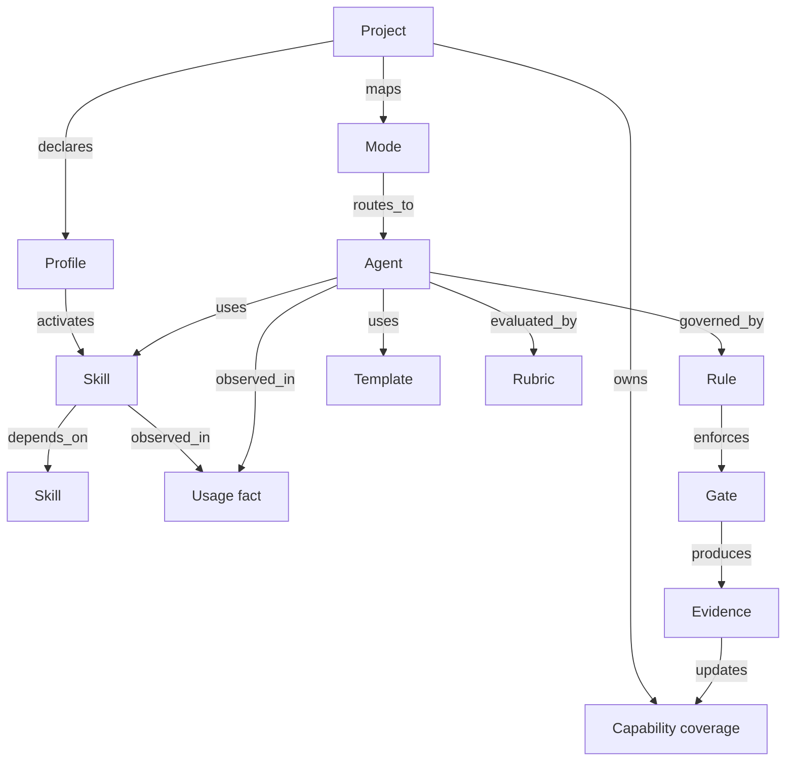

---
metadata:
  source: negritaos
  document_version: "1.0.0"
  generated_date: "2026-09-27"
  last_modified_date: "2026-09-27"
  agent_id: software_architect_agent
  router_mode: LP
  project_id: negritaos
  quality_gates_status: PASSED_WITH_WARNINGS
  quality_warnings:
    - "El read model, API y UI del dashboard todavía no están implementados."
    - "Los conteos de uso dependen de instrumentación Brain y no deben inferirse de la configuración."
---

# NegritaOS 360: arquitectura OO, catálogo de capacidades y grafo de proyectos

## Propósito

Definir cómo representar y mostrar en el dashboard 360 todos los proyectos,
agentes, skills, rules, perfiles, modos, templates, sesiones y gates de
NegritaOS. El diseño permite incorporar una skill nueva, modificar un agent o
añadir una rule sin cambiar la UI ni duplicar la lógica de resolución.

## Audiencia y alcance

Está dirigido a los owners de Negrita Brain, registry, dashboard backend,
frontend y documentación. Incluye el contrato OO y el grafo de conocimiento
operativo. No implementa todavía el dashboard, un API productivo ni una base de
datos de grafo.

## Fuentes de verdad

| Dominio | Fuente canónica | El dashboard puede hacer |
|---|---|---|
| Proyectos | `projects/*.yaml` | Leer y derivar cobertura |
| Agents, ownership y routing | `integrator.yaml`, `core/orchestration/metaagent_router.yaml` | Resolver relaciones |
| Skills y perfiles | `skills/catalog.yaml`, `.codex/skills/` | Validar existencia, dependencias y drift |
| Rules | `rules/`, `.codex/rules/` | Mostrar prioridad, alcance y resolución |
| Templates y rubrics | `templates/`, `rubrics/`, `integrator.yaml` | Mostrar dependencias |
| Sesiones y gates | Canonical Brain Memory v2 | Mostrar observaciones y evidencia |
| Uso real | Eventos Brain y receipts | Medir utilización con estado explícito |

El dashboard no escribe en Git, Brain ni los registries. El frontend recibe
campos lógicos y nunca conoce rutas físicas, comandos Git, credenciales ni
dialectos de proveedores.

## Decisión OO

La arquitectura será híbrida:

- `dataclass(frozen=True, slots=True)` para contratos y nodos inmutables.
- `Enum`/`Literal` para estados y relaciones cerradas.
- `NewType` para IDs que no deben mezclarse accidentalmente.
- `Protocol` para adapters sustituibles.
- funciones puras para parseo, normalización y métricas simples.
- servicios pequeños sólo cuando exista estado, cache, IO o una dependencia
  externa real.

No se creará una clase por cada función. La OO se usará para proteger contratos,
ownership y dependencias; los transformadores sin estado seguirán siendo
funciones testeables.

## Contratos Python propuestos

```python
from dataclasses import dataclass, field
from datetime import datetime
from enum import Enum
from typing import Mapping, NewType, Protocol, Sequence


ProjectId = NewType("ProjectId", str)
CapabilityId = NewType("CapabilityId", str)
SourceSha256 = NewType("SourceSha256", str)


class CapabilityKind(str, Enum):
    PROJECT = "project"
    PROFILE = "profile"
    MODE = "mode"
    AGENT = "agent"
    SKILL = "skill"
    RULE = "rule"
    TEMPLATE = "template"
    RUBRIC = "rubric"


class CapabilityStatus(str, Enum):
    DEFINED = "defined"
    RESOLVED = "resolved"
    AVAILABLE = "available"
    USED = "used"
    STALE = "stale"
    MISSING = "missing"
    BLOCKED = "blocked"
    NOT_RUN = "not_run"
    TIMEOUT = "timeout"


@dataclass(frozen=True, slots=True)
class CapabilityNode:
    """One governed project capability or configuration object."""

    id: CapabilityId
    kind: CapabilityKind
    display_name: str
    owner: str | None
    status: CapabilityStatus
    source_ref: str
    source_sha256: SourceSha256 | None
    version: str | None
    project_ids: tuple[ProjectId, ...] = ()
    last_verified_at: datetime | None = None


@dataclass(frozen=True, slots=True)
class CapabilityEdge:
    """One explainable relation in the derived capability graph."""

    source_id: CapabilityId
    target_id: CapabilityId
    relation: str
    evidence_ref: str | None = None


@dataclass(frozen=True, slots=True)
class UsageFact:
    """Observed use of a capability; configuration alone is not usage."""

    capability_id: CapabilityId
    project_id: ProjectId
    session_id: str | None
    observed_at: datetime
    evidence_status: str
    use_count: int


class CapabilityCatalog(Protocol):
    """Provider-neutral read interface for the dashboard catalog."""

    def nodes(self, project_id: ProjectId | None = None) -> Sequence[CapabilityNode]: ...

    def edges(self, project_id: ProjectId | None = None) -> Sequence[CapabilityEdge]: ...

    def usage(self, project_id: ProjectId | None = None) -> Sequence[UsageFact]: ...
```

### Contract invariants

- IDs are globally unique within the catalog and names are display-only.
- `source_ref` points to a canonical registry path or Brain receipt; it is not a
  user-provided frontend path.
- `AVAILABLE` requires a resolved source file or materialized alias.
- `USED` requires a Brain event or evidence receipt; it cannot be inferred from
  being listed in a project YAML.
- `MISSING`, `BLOCKED` and `TIMEOUT` remain distinct states.
- An edge to a missing node is retained as a broken reference for diagnostics.
- `CapabilityEdge` is append-only in the evidence layer; the read model may
  supersede a projection with a new source hash.

## Grafo de conocimiento operativo

El grafo está justificado porque las relaciones son many-to-many y cambian por
proyecto: un agent puede usar varias skills, una skill puede pertenecer a varios
perfiles, una rule puede gobernar múltiples agents y un proyecto puede activar
varios modos. Una tabla plana perdería navegación y detección de gaps.



### Relaciones permitidas

```text
project declares profile
project maps mode
mode routes_to agent
profile activates skill
agent uses skill
agent governed_by rule
agent uses template
agent evaluated_by rubric
skill depends_on skill
rule enforces gate
gate produces evidence
capability observed_in usage_fact
```

La primera versión usará un read model con dos colecciones indexadas:
`capability_nodes` y `capability_edges`, más `usage_facts`. No se introduce una
base de datos de grafo hasta demostrar que los filtros, métricas y navegaciones
no son suficientes con una lista de aristas y sus índices.

## Cómo se muestra

### 1. Overview 360

Tarjetas con:

- proyectos con cobertura completa, parcial o bloqueada;
- agents, skills y rules definidos frente a resueltos;
- capacidades sin uso observado;
- referencias rotas u owners ausentes;
- skills y rules stale;
- gates con warnings o timeouts;
- última sincronización y freshness de la evidencia.

### 2. Matriz de cobertura

Filas: proyectos. Columnas: capacidades (`agent`, `skill`, `rule`, `profile`,
`mode`). Cada celda muestra estado, owner y última evidencia. Filtros:
proyecto, kind, owner, status, profile, mode y fecha de verificación.

### 3. Project Lens

Al seleccionar un proyecto se muestra:

```text
Project
 ├─ Profiles
 ├─ Modes
 │   └─ Agents
 │       ├─ Skills
 │       ├─ Rules
 │       ├─ Rubrics
 │       └─ Templates
 ├─ Usage observed
 ├─ Gates and evidence
 └─ Gaps / next actions
```

### 4. Detalle de capability

Cada agent, skill o rule abre un panel con definición, owner, versión,
dependencias, proyectos que lo usan, fuentes, última verificación, sesiones
observadas y gaps. El grafo muestra sólo 1–3 saltos alrededor del nodo para
evitar una visualización ilegible.

### 5. Knowledge Graph Explorer

Permite seleccionar un proyecto o capability, ocultar tipos de nodo, filtrar por
status y navegar relaciones. Las aristas deben poder abrir su `evidence_ref`.
El grafo es para exploración; las tablas y contratos son la fuente de auditoría.

## Métricas de evaluación por proyecto

Estas métricas evalúan cobertura y evidencia de configuración, no “inteligencia”
del proyecto ni conocimiento semántico del dominio:

```text
resolution_rate = resolved_nodes / declared_nodes
availability_rate = available_nodes / resolved_nodes
usage_rate = used_nodes / available_nodes
ownership_rate = nodes_with_owner / declared_nodes
dependency_health = valid_edges / all_edges
stale_rate = stale_nodes / declared_nodes
evidence_freshness = age of latest verified observation
```

El dashboard debe mostrar cada componente del score y nunca reducir un proyecto
a un único número verde/rojo. Un proyecto con alta configuración y cero uso
observado debe aparecer como `configured_not_observed`, no como “healthy”.

## Read model y boundaries

```text
registry parsers
    -> typed capability contracts
    -> graph builder / edge validator
    -> Brain usage adapter
    -> read model snapshots
    -> logical API DTOs
    -> dashboard UI
```

El backend será responsable de parsear YAML, resolver aliases, calcular estados,
validar edges y ocultar rutas/credenciales. El frontend sólo recibirá DTOs
estables y estados explicables.

## Backlog trazable

| ID | Tarea | Criterio de salida |
|---|---|---|
| CAT-001 | Implementar contratos OO y schemas v1 | Dataclasses, tipos, serialización y validación |
| CAT-002 | Compilar catalog desde registry/integrator/skills/rules | Snapshot determinista y referencias rotas visibles |
| CAT-003 | Construir graph builder y edge validator | Aristas válidas, huérfanas y ciclos reportados |
| CAT-004 | Añadir usage/evidence adapter Brain | `USED` sólo con eventos/receipts verificables |
| CAT-005 | Exponer API lógica read-only | DTOs para overview, matrix, project lens y graph |
| CAT-006 | Implementar dashboard modular | Sin lógica de negocio en componentes UI |
| CAT-007 | Añadir browser/contract tests | filtros, estados, drill-down y empty/error/stale |
| CAT-008 | Añadir freshness, ownership y alertas | gaps accionables con owner y siguiente acción |

## Calidad, actualización y límites

- Los parsers y el graph builder tendrán tests `unittest` deterministas.
- Se validarán esquemas, aristas, ciclos, aliases y referencias rotas.
- El dashboard tendrá estados `verified`, `stale`, `missing`, `blocked`,
  `not_run` y `timeout`.
- Los cambios de registry regenerarán el read model; no se editará a mano.
- No se guardarán prompts, responses, secretos, diffs completos ni rutas
  locales sensibles.
- La UI será modular: data loading, normalization, state/filtering, layout,
  graph/table components, styles y build separados.

Owner inicial: `software_architect_agent` para contratos y boundaries,
`team_lead_ds_agent` para el plan operativo, Brain maintainer para eventos y
dashboard backend/frontend owners pendientes de asignación.

Actualizar este plan cuando cambien los registries, se apruebe el runtime del
dashboard, se versionen los schemas o se complete CAT-001–CAT-008.
