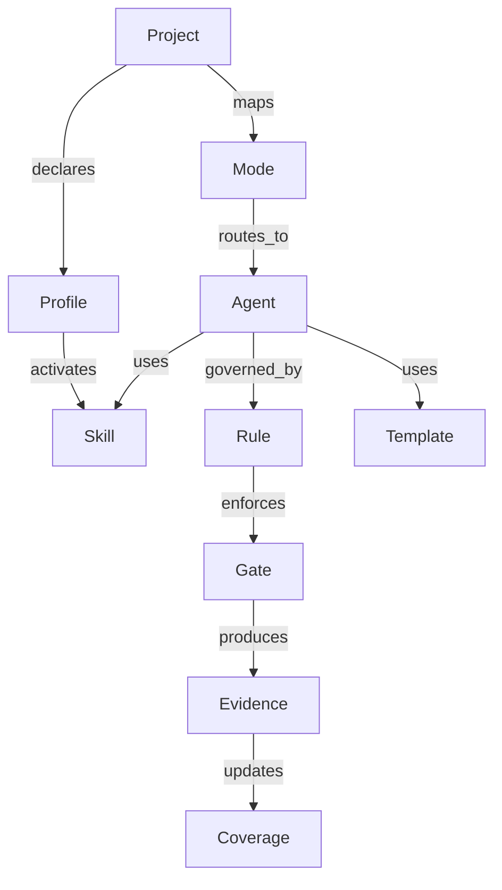

---
metadata:
  source: negritaos
  document_version: "1.1.0"
  generated_date: "2026-09-27"
  last_modified_date: "2026-09-27"
  agent_id: software_architect_agent
  router_mode: LP
  project_id: negritaos
  supersedes: docs/negritaos_360_dashboard_architecture_plan__updated_20260927_122000.md
  quality_gates_status: PASSED_WITH_WARNINGS
  quality_warnings:
    - "El read model, API, execution graph y UI todavía no están implementados."
    - "La configuración actual del checkout principal tiene cambios locales ajenos a este plan."
---

# NegritaOS 360: catálogo, second brain y graph engineering

## Propósito y decisión

Este plan combina tres ideas revisadas:

- AI OS/workflow inventory: extraer workflows recurrentes, convertirlos en
  specs/skills y priorizar por tiempo, repetibilidad y juicio.
- Graph engineering: representar jobs, arrows, state, workers paralelos,
  checker, merger y human gate.
- Second brain por niveles: routing de archivos, wiki, búsqueda semántica,
  knowledge graph y autonomía sólo cuando el nivel inferior ya no resuelve el
  problema.

No construiremos un único grafo gigante. Separaremos:

1. **Capability Graph**: qué existe y cómo está gobernado.
2. **Execution Graph**: cómo se ejecuta un workflow.
3. **Knowledge Graph**: qué entidades y decisiones están relacionadas.

## Fuentes de verdad y límites

- Proyectos: `projects/*.yaml`.
- Agents, ownership y routing: `integrator.yaml` y
  `core/orchestration/metaagent_router.yaml`.
- Skills y perfiles: `skills/catalog.yaml` y `.codex/skills/`.
- Rules: `rules/` y `.codex/rules/`.
- Sesiones, gates, decisiones y receipts: Brain Memory v2.
- Uso: sólo eventos Brain o receipts verificables.

El dashboard será read-only. No almacenará prompts, respuestas, secretos, diffs
completos, datos de clientes ni rutas locales sensibles. CQISense y NegritaOS
mantendrán repositorios y políticas separados.

Fuentes conceptuales:

- [AI OS y workflows](https://www.youtube.com/watch?v=XKUhEvb7Q90).
- [Graph Engineering](https://www.youtube.com/watch?v=JWhICz1QR8M).
- [Second Brain por niveles](https://www.youtube.com/watch?v=DTCyvo6cC54).

## Diseño OO extensible

La base Python usará:

- `dataclass(frozen=True, slots=True)` para contratos inmutables;
- `Enum`, `Literal` y `NewType` para estados y IDs;
- `Protocol` para adapters reemplazables;
- funciones puras para parseo, normalización y métricas;
- servicios pequeños para IO, cache, checkpoints y proveedores.

Ejemplo mínimo:

```python
from dataclasses import dataclass
from datetime import datetime
from enum import Enum
from typing import NewType, Protocol, Sequence

ProjectId = NewType("ProjectId", str)
CapabilityId = NewType("CapabilityId", str)

class CapabilityKind(str, Enum):
    PROJECT = "project"
    PROFILE = "profile"
    MODE = "mode"
    AGENT = "agent"
    SKILL = "skill"
    RULE = "rule"
    TEMPLATE = "template"

class EvidenceStatus(str, Enum):
    VERIFIED = "verified"
    STALE = "stale"
    MISSING = "missing"
    BLOCKED = "blocked"
    TIMEOUT = "timeout"

@dataclass(frozen=True, slots=True)
class CapabilityNode:
    id: CapabilityId
    kind: CapabilityKind
    display_name: str
    owner: str | None
    status: EvidenceStatus
    source_ref: str
    source_sha256: str | None
    project_ids: tuple[ProjectId, ...] = ()
    last_verified_at: datetime | None = None

@dataclass(frozen=True, slots=True)
class GraphEdge:
    source_id: CapabilityId
    target_id: CapabilityId
    relation: str
    evidence_ref: str | None = None

class CapabilityCatalog(Protocol):
    def nodes(self, project_id: ProjectId | None = None) -> Sequence[CapabilityNode]: ...
    def edges(self, project_id: ProjectId | None = None) -> Sequence[GraphEdge]: ...
```

Añadir una skill sólo debe requerir registrar su metadata, enlazarla a los
perfiles/agents y regenerar el read model. La UI no tendrá condiciones especiales
por nombre de skill.

## Capability Graph



Relaciones válidas:

```text
declares, maps, routes_to, activates, uses, governed_by,
depends_on, enforces, produces, observed_in
```

## Execution Graph

Los workflows complejos seguirán este patrón:

```text
Trigger
  -> Planner
  -> parallel workers
  -> skeptic/checker
  -> merger/synthesizer
  -> human gate
  -> output / handoff
```

Primer workflow candidato:

```text
resolve -> plan -> bounded workers -> review -> gate -> commit/handoff
```

Se ejecutará primero de forma manual o mediante archivos versionados. Sólo tras
tres ejecuciones consistentes se evaluará LangGraph, n8n u otra orquestación.
El objetivo es preservar estado, checkpoints, retries, permisos y evidencia.

## Knowledge Graph y second brain

La madurez se aplicará por problema, no al repositorio completo:

| Nivel | Capacidad | Uso |
|---|---|---|
| 1 | Routing de YAML/Markdown/Brain | Fuente y contexto estable |
| 2 | Wiki/read model por proyecto o capability | Agrupar conocimiento |
| 3 | Búsqueda semántica | Corpus grande donde keyword search falla |
| 4 | Knowledge Graph | Cadenas de relaciones entre entidades |
| 5 | Automatización continua | Sólo con workflow probado y human gates |

Contexto evergreen, decisiones y contratos permanecen en fuentes estructuradas.
Transcripts y documentos cambiantes se incorporan mediante adapters y evidencia,
no mediante ingestión automática sin control.

## Implementación del grafo

- Backend: dataclasses, edge list e índices de adyacencia.
- Métricas y validación: NetworkX.
- UI read-only: Cytoscape.js, con subgrafos de 1–3 saltos.
- Tabla/matriz: inventario completo de proyectos y capabilities.
- No se introduce Neo4j en la primera fase.

## Vistas del dashboard

- **Overview 360**: cobertura, freshness, gaps, uso y bloqueos.
- **Capability Catalog**: búsqueda por project, agent, skill, rule, owner y status.
- **Project Lens**: profiles, modes, agents, skills, rules, gates y workflows.
- **Capability Matrix**: proyecto × capability.
- **Knowledge Graph Explorer**: relaciones y evidencia de aristas.
- **Workflow Graph**: jobs, estado, paralelo, checker y human gate.
- **Usage and Gaps**: capacidades configuradas pero no observadas.

El grafo es para exploración; las tablas, contratos y receipts son la fuente de
auditoría.

## Métricas

```text
resolution_rate = resolved_nodes / declared_nodes
availability_rate = available_nodes / resolved_nodes
usage_rate = used_nodes / available_nodes
ownership_rate = nodes_with_owner / declared_nodes
dependency_health = valid_edges / all_edges
stale_rate = stale_nodes / declared_nodes
workflow_reliability = successful_runs / completed_runs
evidence_freshness = age of latest verified observation
```

No se reducirá un proyecto a un único semáforo. Un proyecto configurado pero sin
uso observado aparecerá como `configured_not_observed`.

## Rollout y backlog

| ID | Entrega | Salida |
|---|---|---|
| CAT-001 | Contratos OO y schemas v1 | Dataclasses, tipos y validación |
| CAT-002 | Compiler de registries | Snapshot determinista y referencias rotas |
| CAT-003 | Capability Graph | Edges, ciclos y huérfanos |
| CAT-004 | Project coverage | Métricas y owners |
| CAT-005 | Read model/API | DTOs para overview, matrix, lens y graph |
| CAT-006 | Brain usage adapter | `USED` sólo con evidencia |
| CAT-007 | Dashboard modular | UI sin lógica de negocio |
| CAT-008 | QA y operación | filtros, estados, freshness y alertas |
| FLOW-001 | Workflow manual | Jobs, arrows, state, checker y human gate |
| FLOW-002 | File-based execution graph | Paper trail reproducible |
| FLOW-003 | Orquestación persistente | Checkpoints y retries justificados |
| KNOW-001 | Knowledge entities/relations | Provenance y límites de privacidad |
| KNOW-002 | Semantic retrieval | Sólo donde routing exacto no basta |

## Quality gates y ownership

- unittest para parsers, contracts, edges, aliases y métricas;
- contract tests para DTOs y schemas;
- browser tests para empty, loading, stale, error y blocked;
- regeneración del read model desde fuentes canónicas;
- revisión de privacidad antes de cualquier publicación;
- human gate para commits, cambios de policy, publicaciones y acciones costosas.

Owners iniciales: `software_architect_agent` para contracts y boundaries, Brain
maintainer para eventos/evidence, dashboard backend owner para compiler/read
model/API, frontend owner para Cytoscape/matrix y `team_lead_ds_agent` para
priorización operativa.

Actualizar este plan cuando cambien los registries, se seleccione el runtime,
se versionen los schemas, se añada una graph library o se complete CAT/FLOW/KNOW.
